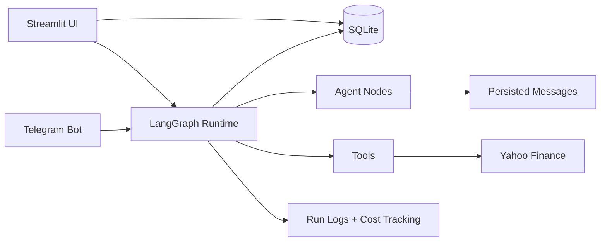

# Minimal AI Agent Orchestration Platform Plan

## Summary

Build the project in two phases:

1. **Phase 1: Streamlit MVP**
   - Fast local prototype with a real LangGraph runtime, SQLite persistence, Telegram integration, agent CRUD, workflow execution, logs, message history, and two workflow templates.
   - This gives a working end-to-end demo quickly.

2. **Phase 2: FastAPI + React Upgrade**
   - Move the backend/runtime into FastAPI and replace Streamlit with a richer React UI.
   - Keep the same database schema, runtime concepts, and workflow templates.

Default choices:

- Runtime: **LangGraph**
- First UI: **Streamlit**
- Production-style upgrade: **FastAPI + React**
- Messaging channel: **Telegram**
- Persistence: **SQLite**
- LLM provider: configurable through environment variables, starting with OpenAI-compatible APIs.

## Step-By-Step Implementation

### 1. Create The Minimal Repo Structure

Start with a simple Python-first repo:

```text
take-home-assignment/
  app/
    main.py
    db.py
    models.py
    runtime/
      graph.py
      tools.py
      agents.py
    channels/
      telegram.py
    templates/
      research_summary.py
      financial_assistant.py
    ui/
      streamlit_app.py
  tests/
    test_agents.py
    test_workflows.py
    test_messages.py
  README.md
  requirements.txt
  .env.example
```

The first version should run with:

```bash
streamlit run app/ui/streamlit_app.py
```

Later, Phase 2 adds:

```text
backend/
  main.py
frontend/
  src/
```

### 2. Define The Minimal Data Model

Use SQLite with SQLAlchemy.

Core tables:

- `agents`
  - `id`
  - `name`
  - `role`
  - `system_prompt`
  - `model`
  - `tools`
  - `channel`
  - `memory_enabled`
  - `guardrails`
  - `created_at`

- `workflows`
  - `id`
  - `name`
  - `description`
  - `template_key`
  - `config_json`

- `messages`
  - `id`
  - `workflow_id`
  - `from_agent_id`
  - `to_agent_id`
  - `channel`
  - `content`
  - `metadata_json`
  - `created_at`

- `runs`
  - `id`
  - `workflow_id`
  - `status`
  - `input`
  - `output`
  - `token_count`
  - `estimated_cost`
  - `created_at`
  - `completed_at`

- `logs`
  - `id`
  - `run_id`
  - `level`
  - `event`
  - `payload_json`
  - `created_at`

Keep schedules as stored config in v1, not a full scheduler yet.

### 3. Build The LangGraph Runtime

Implement a minimal real runtime with multi-agent workflows.

Core runtime behavior:

- Load agents from SQLite.
- Build a LangGraph workflow from a selected template.
- Pass shared workflow state through nodes.
- Persist every inter-agent message.
- Persist logs for every node start, node completion, tool call, and failure.
- Track estimated tokens and cost per run.

Initial runtime entrypoint:

```python
run_workflow(
    workflow_id: str,
    user_input: str,
    source_channel: str = "ui",
    external_user_id: str | None = None,
) -> WorkflowRunResult
```

All UI and Telegram interactions should call this same runtime entrypoint.

### 4. Add Two Workflow Templates

#### Template 1: Research Summary

Flow:

```text
Human input -> Research Agent -> Summarizer Agent -> Final response
```

Use case:

- User asks for a topic.
- Research agent gathers structured notes.
- Summarizer agent creates a concise answer.

Initial agents:

- **Research Agent**
  - Breaks the user request into research questions.
  - Uses available tools to gather notes.
  - Produces structured findings.

- **Summarizer Agent**
  - Converts findings into a clear final answer.
  - Keeps the response concise and useful.

#### Template 2: Financial Assistant

Flow:

```text
Telegram message -> Query Detector Agent -> Company Extractor Agent -> Ticker Resolver Agent -> Market Data Agent -> Response Formatter Agent -> Telegram reply
```

Use case:

- A user sends a stock-related question on Telegram.
- The system detects whether the message is about stocks.
- It extracts the company name or ticker.
- It resolves the extracted target to the exact stock ticker symbol.
- It fetches stock data from Yahoo Finance.
- It sends a simplified response back to Telegram.

Example user messages:

```text
What is Apple's stock price?
How is Tesla doing today?
Give me key stats for NVIDIA.
```

Initial agents:

- **Query Detector Agent**
  - Determines whether the message is a stock or finance query.
  - If the message is not stock-related, returns a polite fallback.

- **Ticker Resolver Agent**
  - Resolves the extracted company name or ticker to a Yahoo Finance-compatible ticker.
  - Examples: `Apple` -> `AAPL`, `NVIDIA` -> `NVDA`.

- **Company Extractor Agent**
  - Extracts the company name or ticker from the message.
  - Passes the extracted target to the ticker resolver.

- **Market Data Agent**
  - Uses the resolved ticker to fetch current stock data.
  - Pulls latest price, change, percent change, market cap, day range, 52-week range, and volume where available.

- **Response Formatter Agent**
  - Converts raw market data into a clean Telegram-friendly response.
  - Includes a short disclaimer that the response is market data only, not financial advice.

Initial financial tool:

```python
get_stock_quote(query: str) -> StockQuote
```

The tool should use `yfinance` or another Yahoo Finance-compatible data access method.

Example Telegram reply:

```text
Apple Inc. (AAPL)

Price: $189.98
Today: +1.24%
Market Cap: $2.91T
Volume: 48.2M
Day Range: $187.40 - $190.21

This is market data only, not financial advice.
```

Each template should define:

- Required agents
- Default prompts
- Workflow graph shape
- Sample input
- Expected output type

### 5. Build The Streamlit MVP UI

Streamlit pages:

- **Dashboard**
  - Total agents
  - Total workflows
  - Recent runs
  - Latest logs

- **Agents**
  - Create, edit, and delete agents.
  - Configure name, role, prompt, model, tools, channel, memory flag, and guardrails.

- **Workflows**
  - Select one of the two templates.
  - Assign agents to workflow roles.
  - Run workflow with a text input.
  - Display final output.

- **Messages**
  - Show persisted inter-agent messages.
  - Filter by run, workflow, agent, or channel.

- **Monitoring**
  - Show live-ish refresh view of logs.
  - Show run status.
  - Show token and estimated cost totals.

The visual workflow builder in the MVP can be a simple node/edge preview rendered from the template config. It does not need drag-and-drop initially.

### 6. Add Telegram Integration

Use Telegram Bot API polling for local simplicity.

Behavior:

- User sends a message to the Telegram bot.
- Telegram adapter receives the message.
- Adapter routes the message to the configured public-facing workflow, preferably the Financial Assistant workflow.
- LangGraph executes the workflow.
- Bot replies with the final response.
- Incoming Telegram messages, inter-agent messages, fetched stock data summaries, and outgoing Telegram replies are saved in `messages`.

Configuration:

```env
TELEGRAM_BOT_TOKEN=
TELEGRAM_ENABLED=true
DEFAULT_TELEGRAM_WORKFLOW_ID=
```

For local demo, run Telegram polling as a separate command:

```bash
python -m app.channels.telegram
```

This is simpler than exposing a webhook through ngrok.

### 7. Add Tests For Critical Paths

Minimum tests:

- Agent creation persists expected fields.
- Workflow template can build a LangGraph graph.
- Research Summary workflow executes with two agents.
- Financial Assistant workflow detects a stock query, resolves a ticker, and formats a response using mocked Yahoo Finance data.
- Workflow execution creates a run record.
- Inter-agent messages are persisted.
- Telegram adapter can route a mocked inbound message to a workflow.
- Logs are created for successful and failed runs.

Use pytest with a SQLite test database.

### 8. Write The README For The Challenge

README sections:

- What the platform does
- Architecture diagram
- Why LangGraph was chosen
- Why Streamlit was used for the MVP
- How to run locally
- How to configure Telegram
- How to create agents
- How to run workflows
- How to add a new workflow template
- How to add a new messaging channel
- Known limitations
- Phase 2 upgrade path to FastAPI + React

Architecture diagram:



### 9. Record The Demo

Demo script:

1. Open Streamlit dashboard.
2. Create or show configured agents.
3. Show the two workflow templates.
4. Run the Research Summary workflow from the UI.
5. Show persisted logs and inter-agent messages.
6. Open Telegram.
7. Send a stock-related message to the bot.
8. Show the bot response with ticker, price, and key stats.
9. Return to UI and show the Telegram conversation persisted in message history.

### 10. Phase 2: Upgrade To FastAPI + React

After the Streamlit MVP works, split the app:

- FastAPI backend:
  - Agent CRUD endpoints
  - Workflow CRUD endpoints
  - Run workflow endpoint
  - Message history endpoints
  - Logs endpoint
  - Telegram route or background polling process

- React frontend:
  - Dashboard
  - Agent manager
  - Workflow builder
  - Run monitor
  - Message/log viewer

Keep the same SQLite schema and LangGraph runtime. Only replace the presentation layer and expose backend APIs.

## Phase 2 Detailed Plan: Next-Generation Agent Orchestration Platform

### Overview
Extend Phase 1 with three major features:
1. **Agent Builder Interface** - Create agents with custom LLM providers, API keys, tools, and MCP integration
2. **Drag-and-Drop Workflow Builder** - Visually build workflows by connecting agents on a canvas
3. **Tech Stack Migration** - Move from Streamlit to FastAPI + React (simplest alternative per original plan)

### Core Principles
- **Non-breaking changes**: Extend existing schema with new columns (defaults for backward compatibility)
- **Preserve Phase 1**: Keep LangGraph runtime, SQLite schema, workflow templates, Telegram integration, and tests
- **Per-agent configuration**: Each agent can have its own LLM provider, API key (encrypted), and model
- **Simple MCP integration**: HTTP-based MCP servers only, similar to yfinance tool pattern
- **Sequential workflows**: Drag-and-drop builder supports only linear flows (no branching/conditionals)
- **Encryption**: API keys encrypted at rest using Fernet symmetric encryption

---

### 1. Schema & Core Logic Extensions

#### 1.1 Database Schema Updates
Add columns to existing tables with defaults:

| Table | New Column | Type | Default | Purpose |
|-------|------------|------|---------|---------|
| `agents` | `llm_provider` | TEXT | NULL | Per-agent LLM override (NULL = use global) |
| `agents` | `llm_api_key_encrypted` | BLOB | NULL | Encrypted per-agent API key |
| `agents` | `llm_model` | TEXT | NULL | Per-agent model override |
| `agents` | `mcp_tools_json` | TEXT | `[]` | JSON list of MCP tool configs |
| `workflows` | `is_custom` | INTEGER | 0 | 0 = template, 1 = custom drag-and-drop |
| `workflows` | `nodes_json` | TEXT | NULL | Custom workflow nodes |
| `workflows` | `edges_json` | TEXT | NULL | Custom workflow edges |

Add to `.env`:
```env
ENCRYPTION_MASTER_KEY= # Generate: python -c "from cryptography.fernet import Fernet; print(Fernet.generate_key().decode())"
```

#### 1.2 Core Logic Updates
- **Encryption Utility**: `app/utils/encryption.py` using `cryptography.fernet.Fernet`
- **Per-Agent LLM Config**: Update `app/runtime/llm.py` to accept agent-specific config
- **Simple MCP Tool Support**: Add to `app/runtime/tools.py`:
  ```python
  def call_mcp_tool(server_url: str, tool_name: str, params: dict) -> dict:
      import requests
      return requests.post(f"{server_url}/tools/{tool_name}", json=params).json()
  ```

---

### 2. FastAPI Backend Setup

#### 2.1 Directory Structure
```
backend/
  main.py          # FastAPI entrypoint, CORS
  routes/
    agents.py      # Agent CRUD (encrypt keys on save)
    workflows.py   # Workflow CRUD, run endpoint, custom workflow save
    runs.py        # Run history
    messages.py    # Message history
    logs.py        # Monitoring logs
  dependencies.py  # DB dependency injection
```

#### 2.2 Key Endpoints
| Method | Endpoint | Purpose |
|--------|----------|---------|
| GET/POST/PUT/DELETE | `/api/agents` | Agent CRUD |
| GET/POST/PUT/DELETE | `/api/workflows` | Workflow CRUD |
| POST | `/api/workflows/{id}/run` | Execute workflow |
| GET | `/api/runs` | List run history |
| GET | `/api/messages` | List messages |
| GET | `/api/logs` | List logs |

#### 2.3 New Dependencies
```
fastapi>=0.115.0
uvicorn>=0.32.0
cryptography>=43.0.0
requests>=2.32.0
```

---

### 3. React Frontend Setup

#### 3.1 Tech Stack
- Vite + TypeScript
- React Flow (drag-and-drop canvas)
- Tailwind CSS
- React Query (state management)

#### 3.2 Page Structure
```
frontend/src/
  pages/
    Dashboard.tsx       # Phase 1 metrics
    Agents.tsx          # Agent Builder
    Workflows.tsx       # Template + custom workflow list
    WorkflowBuilder.tsx # Drag-and-drop canvas
    Messages.tsx        # Message history
    Monitoring.tsx      # Log viewer
  components/
    AgentForm.tsx       # Agent create/edit
    WorkflowCanvas.tsx  # React Flow canvas
    AgentNode.tsx       # Draggable agent node
  api/
    client.ts          # Axios instance
```

---

### 4. Agent Builder Interface

#### 4.1 Features
- Form fields:
  - Name, role, system prompt
  - LLM provider dropdown: `Use Global` / `gemini` / `openai` / `fallback`
  - API key input (masked, encrypted via backend)
  - Model input (override global)
  - Tool selector: Existing tools + MCP tool config (name, description, server URL)
  - Memory enabled, guardrails toggles
- Agent list with edit/delete
- Per-agent keys encrypted at rest, decrypted only at runtime

---

### 5. Drag-and-Drop Workflow Builder

#### 5.1 Features (Sequential Flows Only)
- **Left Sidebar**: Draggable list of created agents
- **Canvas**: React Flow canvas for dropping agent nodes
- **Edge Creation**: Linear sequential edges only (drag from output to input)
- **Right Sidebar**: Configure workflow name, description, agent assignments
- **Save**: Persist custom workflow as `is_custom=1` with nodes/edges JSON
- **Run**: Execute custom workflow via FastAPI endpoint

---

### 6. Implementation Order

1. **FastAPI Backend** - Port Phase 1 logic, add new endpoints
2. **React Frontend** - Scaffold, build Dashboard/Messages/Monitoring
3. **Agent Builder** - Implement agent CRUD UI with LLM/MCP config
4. **Workflow Builder** - Integrate React Flow, implement drag-and-drop
5. **Testing** - Update pytest for FastAPI, add new feature tests
6. **Migration** - Deprecate Streamlit

---

### 7. Testing Strategy

- **Unit Tests**: Extend `test_db.py`, `test_llm.py` for new features
- **API Tests**: FastAPI `TestClient` for all endpoints
- **Integration Tests**: Custom workflow execution with mocked MCP tools
- **Manual Tests**: Telegram with new backend, drag-and-drop workflow execution

---

### 8. Assumptions & Constraints

- **MCP**: HTTP-based MCP servers only (no stdio/local)
- **Encryption**: Fernet symmetric encryption, master key in `.env`
- **Sequential Flows**: No branching/conditionals in Phase 2
- **Backward Compatibility**: New columns have defaults, Phase 1 data works without migration
- **Streamlit**: Will be fully replaced by React (no dual UI maintenance)

## Public Interfaces

Initial Streamlit MVP:

```bash
streamlit run app/ui/streamlit_app.py
python -m app.channels.telegram
pytest
```

Environment variables:

```env
OPENAI_API_KEY=
OPENAI_MODEL=gpt-4o-mini
TELEGRAM_BOT_TOKEN=
TELEGRAM_ENABLED=true
DEFAULT_TELEGRAM_WORKFLOW_ID=
DATABASE_URL=sqlite:///./yuno_agents.db
```

## Test Plan

- Unit test database CRUD for agents, workflows, messages, runs, and logs.
- Unit test both workflow templates.
- Integration test one full Research Summary run.
- Integration test one full Financial Assistant run with mocked Yahoo Finance data.
- Integration test mocked Telegram inbound stock query.
- Manual test Streamlit UI:
  - Create agent.
  - Run workflow.
  - Inspect messages.
  - Inspect logs.
- Manual test Telegram:
  - Send stock-related message.
  - Receive financial assistant response.
  - Confirm message appears in UI.

## Assumptions

- Streamlit is acceptable for the first minimal architecture because the goal is to start basic and then move to FastAPI + React.
- Telegram is the first external channel because it is fastest and least risky for a local demo.
- LangGraph is the runtime because it maps cleanly to multi-agent workflows, explicit state, routing, and feedback loops.
- The first visual workflow builder is template-based with a rendered graph preview, not drag-and-drop.
- Schedules are stored as configuration in v1; actual recurring execution can be added after the demo path works.
- Token/cost tracking can start as estimated tracking based on model responses or simple token approximation.
- The MVP prioritizes one reliable end-to-end demo over a broad generic platform.
