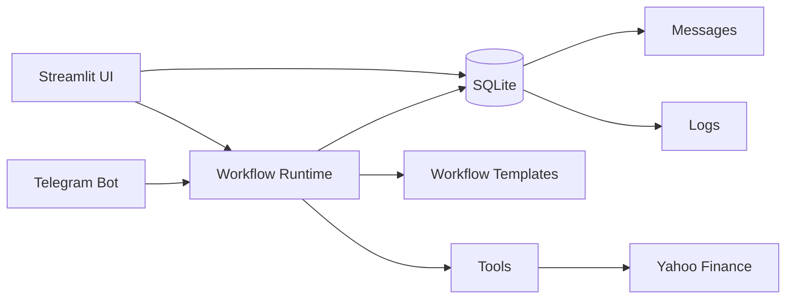

# Yuno AI Agent Orchestration MVP

This repository is a minimal implementation of the Yuno AI Engineer Challenge. It starts with a Streamlit UI, SQLite persistence, a LangGraph-oriented runtime, and a Telegram-first Financial Assistant workflow.

## Architecture



The runtime tries to use LangGraph when available and keeps a small sequential fallback so the MVP remains easy to test locally. The public entrypoint is shared by Streamlit and Telegram:

```python
run_workflow(workflow_id, user_input, source_channel="ui", external_user_id=None)
```

## Workflows

### Research Summary

A two-agent workflow:

```text
Human input -> Research Agent -> Summarizer Agent -> Final response
```

### Financial Assistant

A Telegram-first workflow:

```text
Telegram message -> Query Detector -> Company Extractor -> Ticker Resolver -> Market Data -> Response Formatter -> Telegram reply
```

It detects stock-related messages, extracts the company or ticker mention, resolves it to a Yahoo Finance symbol, fetches market data with `yfinance`, and formats a clean response with a financial-data disclaimer.

## Why Python

Python was chosen for its rich AI/ML ecosystem (LangGraph, google-genai, openai client), 
the broadest available tooling for agent-based workflows, and sqlite3 in the standard 
library keeping setup friction near zero. The async-capable stack (FastAPI + Uvicorn) 
enables non-blocking workflow execution, while the same codebase runs CLI, Streamlit, 
and Telegram entrypoints without duplication.

## Setup

### Backend

```bash
python3 -m venv .venv
source .venv/bin/activate
pip install -r requirements.txt
cp .env.example .env
# Edit .env with your API keys
python -m app.main
```

### Frontend (React + Vite)

```bash
cd frontend
npm install
npm run dev
```

The frontend expects the backend at `http://localhost:8000`. Start the backend first.

### LLM Configuration

The app supports multiple providers. Set your choice in `.env`:

```env
LLM_PROVIDER=groq
GROQ_API_KEY=your-groq-api-key
GROQ_MODEL=gpt-oss-120B
GROQ_BASE_URL=https://api.groq.com/openai/v1
```

Or use Gemini:

```env
LLM_PROVIDER=gemini
GEMINI_API_KEY=your-gemini-api-key
GEMINI_MODEL=gemini-2.5-flash-lite
```

### Run tests

```bash
pytest
```

### Run Telegram polling

```bash
python -m app.channels.telegram
```

Set `TELEGRAM_BOT_TOKEN` in `.env` before running the bot. Use `/workflows` to list workflows and `/use <id>` to switch.

### Run the scheduler (optional)

```bash
python -m app.scheduler
```

Runs due workflows on a schedule. Create schedules via the UI at `/schedules`.

## Why This Stack

- **LangGraph** (over CrewAI, AutoGen, or a custom runtime) — chosen because its StateGraph 
  maps naturally to multi-agent workflows with explicit state passing between nodes. It 
  supports conditional routing for future branching and keeps orchestration declarative 
  rather than hidden in callbacks. CrewAI adds abstraction overhead for linear templates. 
  AutoGen requires more boilerplate for simple sequential flows. LangGraph gives 
  production-grade graph execution with minimal code.
- **Streamlit** kept the first version small while validating the runtime and persistence model.
- **FastAPI + React** replaced Streamlit in Phase 2 for a production-grade separation between 
  the API layer, runtime, and frontend.
- **SQLite** is enough for a local demo and makes setup friction near zero.
- **Telegram** is the fastest external messaging channel to demonstrate locally, with a 
  polling-based adapter that requires no webhook configuration.

## Adding A Workflow Template

1. Add a template file under `app/templates/` following the `WorkflowTemplate` dataclass in `types.py`.
2. Define nodes, edges, sample input, and default config (see `research_summary.py` or `financial_assistant.py`).
3. Register it in `app/templates/registry.py` by adding it to the `TEMPLATES` dict.
4. Add node handler functions in `app/runtime/graph.py` (for template-specific logic) or rely on `_build_agent_node` for agent-assigned templates.
5. Add a test covering the workflow execution path in `tests/test_workflows.py`.

## Adding A New Messaging Channel

1. Create a new file under `app/channels/` (e.g., `slack.py`, `whatsapp.py`).
2. Implement a polling or webhook-based adapter that:
   - Receives incoming messages
   - Calls `run_workflow(workflow_id, user_input, source_channel="slack", ...)`
   - Sends `result.output` back to the channel
3. Register the channel's entrypoint in `pyproject.toml` or as a `python -m` command.
4. Add channel-specific config keys to `app/config.py` and `.env.example`.
5. Add a test in `tests/test_channels.py` covering message routing with a mocked adapter.

See `app/channels/telegram.py` as a reference implementation.

## Impact Metrics

The platform captures four key metrics displayed on the Dashboard and available via `GET /api/metrics`:

| Metric | Description |
|--------|-------------|
| Configurable dimensions per agent | 14 editable fields per agent (name, role, prompt, model, tools, channel, memory, guardrails, personality, LLM provider/key/model, timestamps) |
| Task completion rate | `completed / total runs` from the `runs` table |
| Agent-to-agent messages | Total inter-agent messages persisted via `db.add_message()` across all runs |
| Failed runs | Count and percentage of workflows that ended in `failed` status |

These are natural byproducts of the architecture — every agent node persists a message, every run is recorded with status, and the agent form fields define the configurable dimensions.

## Known Limitations

- The visual workflow builder supports only linear flows (no conditional branching or feedback loops yet).
- Token cost tracking is a word-count estimate; actual LLM token usage is logged but not used for cost.
- The research tool (`web_search_stub`) returns mock data — replace with a real search API (Tavily, SerpAPI) for production.
- Memory accumulates within a single run but does not persist across runs.
- Telegram only — WhatsApp and Slack adapters are not yet implemented.

## Phase 2 Direction

The next version should split the app into a FastAPI backend and React frontend while preserving the SQLite schema, runtime entrypoint, workflow templates, Telegram adapter, and tests.
