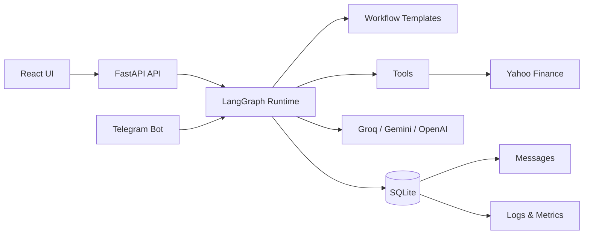

# Yuno AI Agent Orchestration Platform

A multi-provider AI agent orchestration platform with a FastAPI backend, React frontend, LangGraph runtime, SQLite persistence, and Telegram integration.

## Architecture



## Features

- **Agent CRUD** — Create agents with name, role, system prompt, model, tools, channel, personality (7 tones), guardrails, memory toggle, and per-agent LLM provider configuration
- **Workflow Templates** — Research Summary (2 agents) and Financial Assistant (5 agents) with agent assignment
- **Custom Drag-and-Drop Builder** — React Flow canvas to build and connect multi-agent workflows
- **Telegram Bot** — `/workflows`, `/use <number|name>` to switch workflows, live execution
- **Schedules** — Interval-based recurring workflow execution (15 min → weekly)
- **Live Monitoring** — Real-time logs (polling), inter-agent messages, token/cost tracking, runtime per operation
- **Impact Metrics** — Dashboard with completion rate, avg/total runtime, configurable dimensions, agent messages
- **Multi-Provider LLM** — Groq, Gemini, OpenAI with per-agent override

## Setup

### Backend

```bash
python3 -m venv .venv
source .venv/bin/activate
pip install -r requirements.txt
cp .env.example .env
```

Edit `.env` with your API keys:

```env
LLM_PROVIDER=groq
GROQ_API_KEY=your-groq-api-key
GROQ_MODEL=gpt-oss-120B
```

Initialize the database:

```bash
python -m app.main
```

### Frontend

```bash
cd frontend
npm install
npm run dev
```

The frontend runs at `http://localhost:5173` and expects the backend at `http://localhost:8000`.

### Run Backend Server

```bash
uvicorn backend.main:app --reload --port 8000
```

### Run Telegram Bot

```bash
python -m app.channels.telegram
```

Set `TELEGRAM_BOT_TOKEN` in `.env`.

### Run Scheduler (optional)

```bash
python -m app.scheduler
```

### Run Tests

```bash
pytest
```

## Why This Stack

- **LangGraph** (over CrewAI, AutoGen, or custom runtime) — StateGraph maps naturally to multi-agent workflows with explicit state passing. Supports conditional routing for future branching. CrewAI adds abstraction overhead for linear templates. AutoGen requires more boilerplate for simple sequential flows.
- **FastAPI + React** — Production-grade separation between API layer, runtime, and frontend.
- **SQLite** — Zero-config persistence, enough for local demos.
- **Telegram** — Fastest external channel to demonstrate locally with polling-based adapter.

## Adding a Workflow Template

1. Add a template file under `app/templates/` following the `WorkflowTemplate` dataclass.
2. Register it in `app/templates/registry.py`.
3. Add node handlers in `app/runtime/graph.py` (or rely on `_build_agent_node` for agent-assigned templates).
4. Add the template to the frontend `TEMPLATES` array in `frontend/src/pages/WorkflowCreate.tsx`.
5. Add a test in `tests/test_workflows.py`.

## Adding a Messaging Channel

1. Create a new file under `app/channels/` (e.g., `slack.py`).
2. Implement an adapter that receives messages, calls `run_workflow()`, and sends the output back.
3. Add config keys to `app/config.py` and `.env.example`.
4. Register a `python -m` entrypoint.
5. Add a test in `tests/test_channels.py`.

See `app/channels/telegram.py` as a reference implementation.

## Impact Metrics

| Metric | Description |
|--------|-------------|
| Configurable dimensions/agent | 14 editable fields per agent |
| Task completion rate | `completed / total` from runs table |
| Avg runtime | Mean execution time per workflow in ms |
| Total runtime | Cumulative execution time across all runs |
| Agent-to-agent messages | Total inter-agent messages persisted |
| Failed runs | Count and % of workflows that failed |
