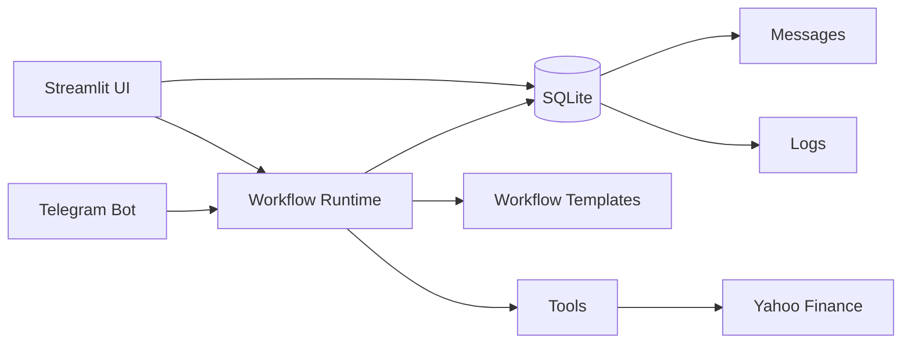

# Yuno AI Agent Orchestration MVP

This repository is a minimal implementation of the Yuno AI Engineer Challenge. It starts with a Streamlit UI, SQLite persistence, a LangGraph-oriented runtime, and a Telegram-first Financial Assistant workflow.

## Architecture



The runtime tries to use LangGraph when available and keeps a small sequential fallback so the MVP remains easy to test locally. The public entrypoint is shared by Streamlit and Telegram:

```python
run_workflow(workflow_id, user_input, source_channel="ui", external_user_id=None)
```

## Workflows

### Research Summary

A two-agent workflow:

```text
Human input -> Research Agent -> Summarizer Agent -> Final response
```

### Financial Assistant

A Telegram-first workflow:

```text
Telegram message -> Query Detector -> Company Extractor -> Ticker Resolver -> Market Data -> Response Formatter -> Telegram reply
```

It detects stock-related messages, extracts the company or ticker mention, resolves it to a Yahoo Finance symbol, fetches market data with `yfinance`, and formats a clean response with a financial-data disclaimer.

## Setup

```bash
python3 -m venv .venv
source .venv/bin/activate
pip install -r requirements.txt
cp .env.example .env
python -m app.main
```

Run the UI:

```bash
streamlit run app/ui/streamlit_app.py
```

## Gemini Configuration

To run the agent nodes through Gemini, set these values in `.env`:

```env
LLM_PROVIDER=gemini
GEMINI_API_KEY=your-gemini-api-key
GEMINI_MODEL=gemini-2.5-flash-lite
```

The dashboard shows the active provider, model, and mode. After a workflow run, the Monitoring page should include:

```text
llm.call.started
llm.call.completed
```

Those log rows include `provider`, `model`, `mode`, `node`, latency, and token counts when Gemini returns usage metadata. If `GEMINI_API_KEY` is missing, the app stays runnable in fallback mode and marks LLM calls as `mode: fallback`.

Run tests:

```bash
pytest
```

Run Telegram polling:

```bash
python -m app.channels.telegram
```

Set `TELEGRAM_BOT_TOKEN` in `.env` or your shell before running the bot.

## Why This Stack

- **LangGraph** maps well to multi-agent workflows, explicit state, routing, and future feedback loops.
- **Streamlit** keeps the first version small and demoable while validating the runtime and persistence model.
- **SQLite** is enough for a local challenge demo and makes setup friction low.
- **Telegram** is the fastest external messaging channel to demonstrate locally.

## Adding A Workflow Template

1. Add a template file under `app/templates/`.
2. Define nodes, edges, sample input, and default config.
3. Register it in `app/templates/registry.py`.
4. Add node handlers in `app/runtime/graph.py`.
5. Add a test covering the workflow execution path.

## Known Limitations

- The visual workflow builder is currently template-based rather than drag-and-drop.
- Schedules are stored as config in the plan, but recurring execution is not implemented yet.
- Cost tracking is estimated from response size.
- The LLM layer is intentionally minimal in this first pass; the runtime is ready for model-backed agent nodes.

## Phase 2 Direction

The next version should split the app into a FastAPI backend and React frontend while preserving the SQLite schema, runtime entrypoint, workflow templates, Telegram adapter, and tests.
